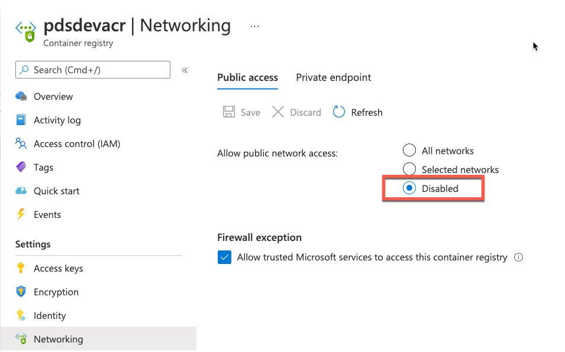
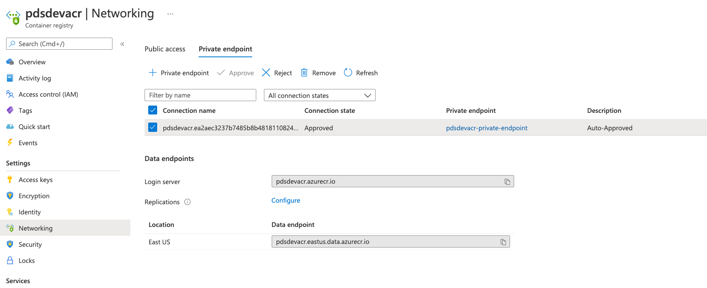
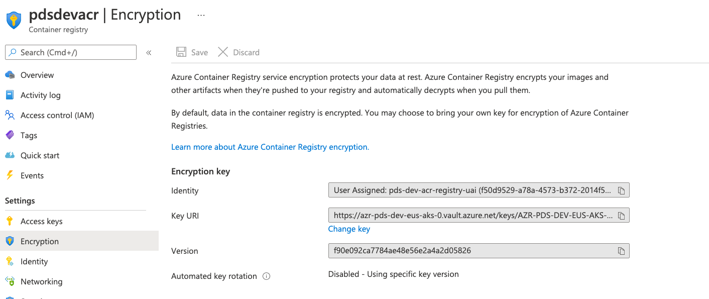

# Azure Container Registry(ACR) - Security Playbook <!-- omit in toc -->

## Capgroup Cybersecurity Control Alignment <!-- omit in toc -->
<br>

**Generated By:**  
[Philip Phan (PHLP)](https://cgweb3/profile/PHLP)
<br>
Platform Design Services

[Rob Goss (RMG)](https://cgweb3/profile/RMG)
<br>
Security Engineering
<br>


**Last Update:** *07/29/2021*

## Table of Contents <!-- omit in toc -->
- [Overview](#overview)
- [Cloud Security Requirements](#cloud-security-requirements)
  - [1. ACR deployed with private endpoints and public access disabled](#1-acr-deployed-with-private-endpoints-and-public-access-disabled)
  - [2. ACR Data is encrypted using CG Managed Keys](#2-acr-data-is-encrypted-using-cg-managed-keys)
  - [3. ACR connections are protected with TLS 1.2](#3-acr-connections-are-protected-with-tls-12)
  - [4. Least privilege is assigned to users & Azure services that need access to ACR.](#4-least-privilege-is-assigned-to-users--azure-services-that-need-access-to-acr)
- [Operational Best Practices](#operational-best-practices)
  - [1. Images stored in ACR are being scanned for vulnerabilities and compliance checks.](#1-images-stored-in-acr-are-being-scanned-for-vulnerabilities-and-compliance-checks)
  - [2. ACR is tagged according to CG standards](#2-acr-is-tagged-according-to-cg-standards)
- [Endnotes](#endnotes)
- [Capital Group Glossary](#capital-group-glossary)
<br><br>

## Overview
Azure Container Registry (ACR) allows you to build, store, and manage container images and artifacts in a private registry. 
The following playbook will outline what the Azure best practices are and how to implement these best practices when provisioning ACR. <br> <br>
Terraform sample code will be taken from this ACR Repo -  https://github.com/open-itg/azure-acr-module/blob/master/main.tf
<br><br>

## Cloud Security Requirements


### 1. ACR deployed with private endpoints and public access disabled 
ACR can be configured to disable public access.  Private endpoints must created in CG subnet to allow network traffic to remain on a private network only. 
<br>

**Capital Group:** <br>

|Control Statement|Description|
|------|----------------------|
|[CS0012300](https://capitalgroup.service-now.com/cg_grc?sys_id=80df48c01bac20506a50beef034bcb47&table=sn_compliance_policy_statement&id=cg_grc_action_item_details&view=sp)|Cloud products and services must be deployed on private subnets and public access must be disabled for these services.
<br>

**Why?**<br>
Azure container registries by default accept connections over the internet from hosts on any network. To protect your registries from potential threats, disable public access and enable private endpoints. 

<br>

**How?**<br>
Public access can be disabled via configuration, but will require a Azure Private Endpoint to access the registry. 
The private link handles the connectivity between the consumer and services over the Azure backbone network.

<br>

**Steps for Disabling Public Access and Enabling Private Endpoints**<br> <br>

   **Step 1:** Disable public network access (https://registry.terraform.io/providers/hashicorp/azurerm/latest/docs/resources/container_registry#public_network_access_enabled) <br> 
   ```
   resource "azurerm_container_registry" "acr" {
     name                          = var.acr_name
     public_network_access_enabled = "false"
   ```
   Configuration on Azure Portal <br>
   
   <br>

   **Step 2:** Enable Azure Private Endpoint to access ACR from CG Network. <br> https://docs.microsoft.com/en-us/azure/container-registry/container-registry-private-link <br>
   ```
    resource "azurerm_private_endpoint" "acr-private-endpoint" {
      name                = "${var.acr_name}-private-endpoint"
      location            = azurerm_resource_group.acr_resource_group.location
      resource_group_name = azurerm_resource_group.acr_resource_group.name
      subnet_id           = var.subnet_id

      private_service_connection {
        name                           = "${var.acr_name}-private-serviceconnection"
        private_connection_resource_id = azurerm_container_registry.acr.id
        is_manual_connection           = false
        subresource_names              = ["registry"]
      }
    }
   ```
   <br>
   Configuration on Azure Portal <br>
   


<br>

### 2. ACR Data is encrypted using CG Managed Keys
<br>

**Capital Group:** <br>
|Control Statement|Description|
|------|----------------------|
|[CS0012168](https://capitalgroup.service-now.com/cg_grc?sys_id=b6df51521b5a8050da4bdca4bd4bcb48&table=sn_compliance_policy_statement&id=cg_grc_action_item_details&view=sp)|Strong encryption key management controls are in place for cloud provider services to protect data at rest.|

<br>

**Why?**<br>
CG's Cloud Security standards require that we ensure registries that holds sensitive, critical or any other data are encrypted to fulfill compliance requirements for data-at-rest encryption.

**How?**<br>

By default, when using ACR, Azure encrypts at rest with service-managed keys. You can specify your own customer managed keys in Azure Key Vault for encryption. 

You'll need the following pre-reqs to configure encryption with Customer Managed Key
- CMK stored in Azure Key Vault
- Managed Identity with Access Policy to access key in Azure Key Vault
- Terraform example of pre-reqs found here - https://github.com/open-itg/azure-acr-module/blob/master/main.tf#L10

Once the pre-reqs are completed below example shows how to configure CMK for ACR.   
```
  #Provision ACR with customer managed key for encryption
  resource "azurerm_container_registry" "acr" {
    name                          = var.acr_name

    encryption {
      enabled            = true
      key_vault_key_id   = var.key_vault_key_id
      identity_client_id = azurerm_user_assigned_identity.keyvault_access_identity.client_id
    }
  }

  #Create managed identity to access key vault
  resource "azurerm_user_assigned_identity" "keyvault_access_identity" {
    resource_group_name = azurerm_resource_group.acr_resource_group.name
    location            = azurerm_resource_group.acr_resource_group.location

    name = var.keyvault_identity_name
    tags = var.tags

  }

  #Grant key permission to managed identity access to use CMK in Azure Key Vault
  resource "azurerm_key_vault_access_policy" "policy" {
    key_vault_id = var.key_vault_id
    tenant_id    = azurerm_user_assigned_identity.keyvault_access_identity.tenant_id
    object_id    = azurerm_user_assigned_identity.keyvault_access_identity.principal_id

    key_permissions = [
      "Get",
      "UnwrapKey",
      "WrapKey"
    ]

  }
```
<br>
   Configuration on Azure Portal <br>
   
   <br>

### 3. ACR connections are protected with TLS 1.2
<br>

**Capital Group:** <br>
|Control Statement|Description|
|------|----------------------|
|[PLACEHOLDER](https://capitalgroup.service-now.com/cg_grc?sys_id=57ef99521b5a8050da4bdca4bd4bcb33&table=sn_compliance_policy_statement&id=cg_grc_action_item_details&view=sp)|PLACEHOLDER|

<br>

**Why?**<br>
Data should be protected in-transit between the customer and Azure, as well as within Azure Services using NIST-approved encryption mechanism.

**How?**<br>
Azure Container Registry enforces data encryption in transit to the service and requires all secure connections from servers and applications to use TLS 1.2. Enable TLS 1.2 by using any recent docker client (version 18.03.0 or later). Support for TLS 1.0 and 1.1 is retired.
<br>
<br>

### 4. Least privilege is assigned to users & Azure services that need access to ACR. 
https://docs.microsoft.com/en-us/azure/container-registry/container-registry-roles?tabs=azure-cli#differentiate-users-and-services

<br>

**Capital Group:** <br>
|Control Statement|Description|
|------|----------------------|
|[CS0012298](https://capitalgroup.service-now.com/cg_grc?sys_id=40df48c01bac20506a50beef034bcb15&table=sn_compliance_policy_statement&id=cg_grc_action_item_details&view=sp)|Access to change cloud identity access and service control policies is restricted to authorized cloud administrative personnel.|
<br>

**Why?**<br>
Limit the privileges you assign to users & resources through Azure RBAC to what the roles require. 

**How?**
Use Azure role-based access control (Azure RBAC) to assign specific permissions to users, service principals, or other identities that need to interact with a registry, for example to pull or push container images. You can also define custom roles with fine-grained permissions to a registry for different operations.

**Example: Assign only AcrPull Policy for AKS Cluster**<br>
Terraform example on how to grant AKS cluster AcrPull Access. <br><br>

   ```
    #Add role to k8s managed identity for ACR pull
    resource "azurerm_role_assignment" "acr_pull_role_assignment" {
      scope                = var.acr_id
      principal_id        = azurerm_kubernetes_cluster.aks_control_plane.kubelet_identity[0].object_id
      role_definition_name = "AcrPull"

    }
   ```


<br><br>

## Operational Best Practices


### 1. Images stored in ACR are being scanned for vulnerabilities and compliance checks. 

<br>
NIST CSF:
|NIST Subcategory Control|Description|
|-----------|------------------------|
|DE.CM-4|Malicious code is detected|
|DE.CM-8|Vulnerability scans are performed|

**Why?** Prisma Cloud container scanning helps in identifying software vulnerabilities in your container images. You can review the scan findings for information about the security of the container images that are being deployed.

**How?** Reach out to PDS Team(PDS_-_Platform_Design_services@capgroup.com) for onboarding your Azure Container Registry to Prisma Cloud. 
https://docs.paloaltonetworks.com/prisma/prisma-cloud/prisma-cloud-admin-compute/vulnerability_management/registry_scanning0/scan_acr.html 
<br>


### 2. ACR is tagged according to CG standards
**Capital Group:** <br>

|Control Statement|Description|
|------|----------------------|
|Control Definition Needed|Control Definition Description Needed|

**What, Why & How?**

Tagging resources in the cloud is an easy way for teams to provide information related to who owns the resource, what the resource is used for, as well as other important information related to the deployment lifecycle of the resource. CG has mandated that all cloud resources are to be tagged with certain important for cross-team use. Although most of the mandatory tags will be added through automation, one should still check to make sure that all newly deployed recources have the appropriate tags attached. please see the documentation below for the latest tagging standards.

[CG Cloud Tagging Strategy](https://confluence.capgroup.com/display/HCEA/Resource+Tagging+standards)
<br><br>


## Endnotes
**Resources**<br>
1. https://docs.microsoft.com/en-us/azure/container-registry/
2. https://docs.microsoft.com/en-us/azure/container-registry/container-registry-private-link
3. https://docs.microsoft.com/en-us/security/benchmark/azure/baselines/container-registry-security-baseline
4. https://docs.microsoft.com/en-us/azure/container-registry/container-registry-customer-managed-keys
   

## Capital Group Glossary 
**Data** - Digital pieces of information stored or transmitted for use with an information system from which understandable information is derived. Items that could be considered to be data are: Source code, meta-data, build artifacts, information input and output.  
 
**Information System** - An organized assembly of resources and procedures for the collection, processing, maintenance, use, sharing, dissemination, or disposition of information. All systems, platforms, compute instances including and not limited to physical and virtual client endpoints, physical and virtual servers, software containers, databases, Internet of Things (IoT) devices, network devices, applications (internal and external), Serverless computing instances (i.e. AWS Lambda), vendor provided appliances, and third-party platforms, connected to the Capital Group network or used by Capital Group users or customers.

**Log** - a record of the events occurring within information systems and networks. Logs are composed of log entries; each entry contains information related to a specific event that has occurred within a system or network.

**Information** - communication or representation of knowledge such as facts, data, or opinions in any medium or form, including textual, numerical, graphic, cartographic, narrative, or audiovisual. 

**Cloud computing** - A model for enabling ubiquitous, convenient, on-demand network access to a shared pool of configurable computing resources (e.g., networks, servers, storage, applications, and services) that can be rapidly provisioned and released with minimal management effort or service provider interaction.

**Vulnerability**  - Weakness in an information system, system security procedures, internal controls, or implementation that could be exploited or triggered by a threat source. Note: The term weakness is synonymous for deficiency. Weakness may result in security and/or privacy risks.