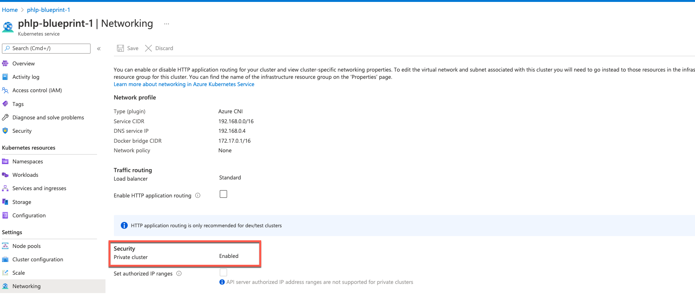
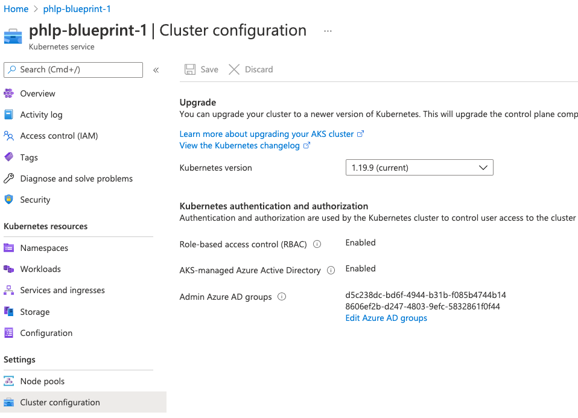

# Azure Kubernetes Service(AKS) - Security Playbook <!-- omit in toc -->

## NIST Cybersecurity Framework Alignment <!-- omit in toc -->

**Generated By:**  
[Rob Goss (RMG) (https://cgweb3/profile/RMG)]
<br>
[Philip Phan (PHLP)(https://cgweb3/profile/PHLP)]
<br>
Security Engineering
<br>
Platform Design Services

**Last Update:** *04/29/2021*

## Table of Contents <!-- omit in toc -->
- [Overview](#overview)
- [Preventative Controls](#preventative-controls)
  - [1. AKS deployed in Private VNET with no public access](#1-aks-deployed-in-private-vnet-with-no-public-access)
  - [2. Data is protected using a CG Managed Key](#2-data-is-protected-using-a-cg-managed-key)
  - [3. AKS enforce least privilege for access to API server & nodes](#3-aks-enforce-least-privilege-for-access-to-api-server--nodes)
  - [4. AKS utilizes managed identities with least priviledge assigned](#4-aks-utilizes-managed-identities-with-least-priviledge-assigned)
  - [5. AKS connections are protected with TLS 1.2](#5-aks-connections-are-protected-with-tls-12)
- [Detective Controls](#detective-controls)
  - [1. AKS Resources are tagged according to CG standards](#1-aks-resources-are-tagged-according-to-cg-standards)
  - [2. AKS logging enabled and sent to Splunk](#2-aks-logging-enabled-and-sent-to-splunk)
- [Respond/Recover](#respondrecover)
- [Endnotes](#endnotes)
- [Capital Group Glossary](#capital-group-glossary)

## Overview
Azure Kubernetes Service(AKS) is a managed Kubernetes offering in Microsoft Azure which simplifies deployment & management of a kubernetes cluster. 
Kubernetes control plane is managed by Azure, you only manage the agent nodes.  

The following playbook will outline what the Azure best practices are and how to implement these best practices when provisioning an AKS Cluster. 


## Preventative Controls


### 1. AKS deployed in Private VNET with no public access
AKS control plane can be configured to private and provisioned within a CG Virtual Network.  This allows network traffic between Control Plane and node pools to remain on a private network only. 

**NIST CSF:** <br>

<br>

**Capital Group:** <br>

|Control Statement|Description|
|------|----------------------|
|1|Any Azure service used by CG should not be directly available to the Internet and the default route is always the CG gateway.
|2| 
<br>

**Why?**<br>
When creating a new cluster, Azure AKS creates an endpoint for the managed Kubernetes API server used to communicate with the cluster (using kubernetes management tools such as kubectl). By default, this API server endpoint is public to the internet. 

By default, Azure AKS also provisions a public load balancer for egress traffic  this can be disabled with the correct settings.  

<br>

**How?**<br>
Private access can be enabled to the Kubernetes API server so that all communication between node pools and the API server stays within the Virtual Network. If you only need to manage the Kubernetes cluster from within a VNet, a private cluster API endpoint can be leveraged, which prevents traffic from traversing the open internet. 

Enable user Defined Routing to disable the public egress load balancer that get provisioned with AKS. 

Define Kubernetes Ingress Controllers with private, internal ip addresses to limit access from the internet. 


**Enabling Private Cluster**<br>
In this section instructions are for Azure AKS provisioning with terraform for a private cluster api endpoint.<br><br>
   **Step 1:** Enable Private Cluster under Network Settings. This will set the kubernetes api endpoint private (https://registry.terraform.io/providers/hashicorp/azurerm/latest/docs/resources/kubernetes_cluster#private_cluster_enabled) <br> 
   ```
   private_cluster_enabled=true
   ```
   Screenshot of configuration on Azure Portal. <br>
   
   <br>

   **Step 2:** Enable User Defined Routing. This will prevent Azure AKS from provisioning a public load balancer for egress. <br> https://docs.microsoft.com/en-us/azure/aks/egress-outboundtype <br>https://registry.terraform.io/providers/hashicorp/azurerm/latest/docs/resources/kubernetes_cluster#outbound_type <br>
   ```
   outbound_type=userDefinedRouting
   ```
   <br>

   **Step 3:**  Provision private ingress controller/load balancer by setting this annotation on ingress controller deployment. <br>
   ```
   service.beta.kubernetes.io/azure-load-balancer-internal: "true"
   ```


### 2. Data is protected using a CG Managed Key 

**NIST CSF:** <br>

<br>

**Capital Group:** <br>

Capital Group:
|Control Statement|Description|
|------|----------------------|
|1|All Data-at-rest must be encrypted and use a CG BYOK encryption key.|
|2|
<br>

**Why?**<br>
Data should be protected in-transit between the customer and Azure, as well as within Azure Services using NIST-approved encryption mechanism.

**How?**<br>

By default, when using AKS, OS and data disks are encrypted at rest with platform-managed keys, meaning that the caches for these disks are also by default encrypted at rest with platform-managed keys. You can specify your own managed keys following Bring your own keys (BYOK) with Azure disks in Azure Kubernetes Service.

When creating Kubernetes storage classes within your cluster, you are available to specify that the Disk storage class is encrypted, and you are able to set a defined storage class as a default. Kubernetes storage classes on Azure DIsk can be encrypted with customer-managed keys.  

```
kind: StorageClass
apiVersion: storage.k8s.io/v1  
metadata:
  name: hdd
provisioner: kubernetes.io/azure-disk
parameters:
  skuname: Standard_LRS
  kind: managed
  diskEncryptionSetID: "/subscriptions/{myAzureSubscriptionId}/resourceGroups/{myResourceGroup}/providers/Microsoft.Compute/diskEncryptionSets/{myDiskEncryptionSetName}"
```


### 3. AKS enforce least privilege for access to API server & nodes 
**Why?**<br>
One of the most important way to secure your cluster is to secure access to the Kubernetes API server.  To control access to the API server, AKS can be configured to use Azure Active Directory(AD) for user authentication.  

You can also configure Kubernetes RBAC to limit access to a cluster resource based on group membership. 

**Enabling Azure AD Integration for RBAC**<br>
Terraform example on how to integrate AKS with Azure Active Directory. <br><br>
   **Step 1:** Enable RBAC with Azure Active Directory (https://registry.terraform.io/providers/hashicorp/azurerm/latest/docs/resources/kubernetes_cluster#azure_active_directory) <br> 

   ```
  role_based_access_control {
    enabled = true
    azure_active_directory {
      managed = true
      admin_group_object_ids = data.azuread_groups.aks_admin_group.object_ids
    }
  }
   ```

Screenshot of configuration on Azure Portal. <br>


### 4. AKS utilizes managed identities with least priviledge assigned
**Why?**<br>
It’s recommended that managed identities is enabled so that the cluster can interact with external Azure resources through Azure AD. 
With managed identities, Azure AD manages and performs the authentication and timely rotation of secrets for you.

**How?**<br>
**Create and Assign Managed Identity to AKS Cluster **<br>
Instructions below are terraform examples <br>

   **Step 1:** Create the managed identity and assign pre-built Azure Roles  <br> 
   ```
    resource "azurerm_user_assigned_identity" "aks_assigned_identity" {
      name                = "aks-${var.aks_cluster_name}-identity"
      resource_group_name = azurerm_resource_group.aks_resource_group.name
      location            = azurerm_resource_group.aks_resource_group.location
    }

    resource "azurerm_role_assignment" "aks_network_contributor" {
      scope                = var.azure_subscription_id
      principal_id         = azurerm_user_assigned_identity.aks_assigned_identity.principal_id
      role_definition_name = "Network Contributor"
    }

    resource "azurerm_role_assignment" "aks_dns_contributor" {
      scope                = var.azure_subscription_id
      principal_id         = azurerm_user_assigned_identity.aks_assigned_identity.principal_id
      role_definition_name = "DNS Zone Contributor"
    }

   ```
   **Step 2:**  Configure UserAssigned identity and link the identity created to AKS Control Plane. (https://registry.terraform.io/providers/hashicorp/azurerm/latest/docs/resources/kubernetes_cluster#type) <br>
   ```
    identity {
      type = "UserAssigned"
      user_assigned_identity_id = azurerm_user_assigned_identity.aks_assigned_identity.id
    }
   ```


### 5. AKS connections are protected with TLS 1.2

**NIST CSF:** <br>

<br>

**Capital Group:** <br>

Capital Group:
|Control Statement|Description|
|------|----------------------|
|1|All Data-in-transit must be encrypted using certificates using CG Certificate Authority.|

<br>

**Why?**<br>
Data should be protected in-transit between the customer and Azure, as well as within Azure Services using NIST-approved encryption mechanism.

**How?**<br>
Communication with the Azure AKS API endpoint enforces HTTPS and Kubernetes default management communications on AKS are TLS encrypted between kubectl. 

Install a CG certificate into the Private Ingress Controller used for ingress traffic. 


## Detective Controls


### 1. AKS Resources are tagged according to CG standards

`This Section will be updated soon.`

### 2. AKS logging enabled and sent to Splunk

`This Section will be updated soon.`


## Respond/Recover


`This Section will be updated soon.`
<br><br>

## Endnotes
**Resources**<br>
1. https://docs.microsoft.com/en-us/azure/aks/intro-kubernetes
2. https://docs.microsoft.com/en-us/azure/aks/private-clusters
3. https://docs.microsoft.com/en-us/azure/aks/azure-disk-customer-managed-keys
4. https://docs.microsoft.com/en-us/azure/aks/azure-ad-rbac
5. https://docs.microsoft.com/en-us/azure/architecture/reference-architectures/containers/aks/secure-baseline-aks#integrate-azure-active-directory-for-the-cluster
6. https://docs.microsoft.com/en-us/azure/aks/concepts-security#azure-network-security-groups
7. [https://docs.microsoft.com/en-us/azure/aks/operator-best-practices-cluster-security ](https://docs.microsoft.com/en-us/azure/aks/operator-best-practices-cluster-security#secure-access-to-the-api-server-and-cluster-nodes)


<br>

## Capital Group Glossary 
**Data** - Digital pieces of information stored or transmitted for use with an information system from which understandable information is derived. Items that could be considered to be data are: Source code, meta-data, build artifacts, information input and output.  
 
**Information System** - An organized assembly of resources and procedures for the collection, processing, maintenance, use, sharing, dissemination, or disposition of information. All systems, platforms, compute instances including and not limited to physical and virtual client endpoints, physical and virtual servers, software containers, databases, Internet of Things (IoT) devices, network devices, applications (internal and external), Serverless computing instances (i.e. AWS Lambda), vendor provided appliances, and third-party platforms, connected to the Capital Group network or used by Capital Group users or customers.

**Log** - a record of the events occurring within information systems and networks. Logs are composed of log entries; each entry contains information related to a specific event that has occurred within a system or network.

**Information** - communication or representation of knowledge such as facts, data, or opinions in any medium or form, including textual, numerical, graphic, cartographic, narrative, or audiovisual. 

**Cloud computing** - A model for enabling ubiquitous, convenient, on-demand network access to a shared pool of configurable computing resources (e.g., networks, servers, storage, applications, and services) that can be rapidly provisioned and released with minimal management effort or service provider interaction.

**Vulnerability**  - Weakness in an information system, system security procedures, internal controls, or implementation that could be exploited or triggered by a threat source. Note: The term weakness is synonymous for deficiency. Weakness may result in security and/or privacy risks.