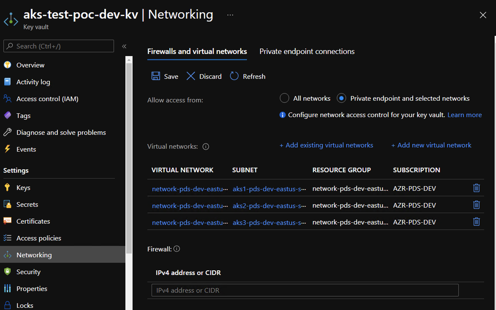

# Azure Key Vaults - Security Playbook <!-- omit in toc -->

## Capgroup Cybersecurity Control Alignment <!-- omit in toc -->
 

**Generated By:**  
[Darshan Chinvar Prakash (DRCP)](https://cgweb3/profile/DRCP)
 
Platform Design Services

[Rob Goss (RMG)](https://cgweb3/profile/RMG)
 
Security Engineering
 

**Last Update:** *09/22/2021*

## Table of Contents <!-- omit in toc -->
- [Overview](#overview)
- [Preventative Controls](#preventative-controls)
  - [1. Virtual network service endpoints](#1-Virtual-network-service-endpoints)
  - [2. Data protection using a CG Managed Key](#2-Data-protection-using-a-CG-Managed-Key)
  - [3. Least privilege for access](#3-Least-privilege-for-access)
  - [4. Managed identities](#4-Managed-identities)
- [Detective Controls](#detective-controls)
  - [1. Resources are tagged according to CG standards](#1-Resources-are-tagged-according-to-cg-standards)
  - [2. Logging enabled and sent to Splunk](#2-Logging-enabled-and-sent-to-splunk)
  - [3. Azure Defender for Key Vault](#2-Azure-Defender-for-Key-Vault)
- [Respond/Recover](#respondrecover)
- [Endnotes](#endnotes)
- [Capital Group Glossary](#capital-group-glossary)
  

## Overview
* Secrets Management - Azure Key Vault can be used to Securely store and tightly control access to tokens, passwords, certificates, API keys, and other secrets
* Key Management - Azure Key Vault can also be used as a Key Management solution. Azure Key Vault makes it easy to create and control the encryption keys used to encrypt your data.
* Certificate Management - Azure Key Vault is also a service that lets you easily enroll, manage, and deploy public and private Transport Layer Security/Secure Sockets Layer (TLS/SSL) certificates for use with Azure and your internal connected resources. 

The following playbook will outline what the Azure best practices are and how to implement these best practices when provisioning Key Vaults. 
  

## Preventative Controls

### 1. Virtual network service endpoints
The virtual network service endpoints for Azure Key Vault allow you to restrict access to a specified virtual network. The endpoints also allow you to restrict access to a list of IPv4 address ranges. Any user connecting to your key vault from outside those sources is denied access. This allows network traffic to remain on a private network only. 
 

**Capital Group:**  

|Control Statement|Description|
|------|----------------------|
|[CS0012300](https://capitalgroup.service-now.com/cg_grc?sys_id=80df48c01bac20506a50beef034bcb47&table=sn_compliance_policy_statement&id=cg_grc_action_item_details&view=sp)|Cloud products and services must be deployed on private subnets and public access must be disabled for these services.
 

**Why?** 
By default, when you create a new key vault, the Azure Key Vault firewall is disabled. All applications and Azure services can access the key vault and send requests to the key vault. 

 

**How?** 
You can configure Key Vault firewalls and virtual networks to deny access to traffic from all networks (including internet traffic) by default. 

If you would like to authorize a particular service to access key vault through the Key Vault Firewall, you can add it's IP Address to the key vault firewall allow list. 

Enable opted-in to allow trusted Microsoft services, connections from those services are let through the firewall. 
 

Here is an example to enable network restrictions for key vaults.  
   **Step 1:** Choose "Private endpoint and selected networks" under Key Vault's Settings->Networking   

   **Step 2:** Add existing Virtual networks under Key Vault's Settings->Networking->Virtual Networks
    

   **Step 3:**  Add CG other CG IPv4 address or CIDR range  

   Screenshot of configuration on Azure Portal.  
   
    
 
 

### 2. Data protection using a CG Managed Key 
 

**Capital Group:**  
|Control Statement|Description|
|------|----------------------|
|[CS0012168](https://capitalgroup.service-now.com/cg_grc?sys_id=b6df51521b5a8050da4bdca4bd4bcb48&table=sn_compliance_policy_statement&id=cg_grc_action_item_details&view=sp)|Strong encryption key management controls are in place for cloud provider services to protect data at rest.|

 

**Why?** 
Data should be protected in-transit between the customer and Azure, as well as within Azure Services using NIST-approved encryption mechanism.

**How?** 

Import CG Managed Keys into Azure Key Vaults 

 

### 3. Least privilege for access 
 

**Capital Group:**  
|Control Statement|Description|
|------|----------------------|
|[CS0012298](https://capitalgroup.service-now.com/cg_grc?sys_id=40df48c01bac20506a50beef034bcb15&table=sn_compliance_policy_statement&id=cg_grc_action_item_details&view=sp)|Access to change cloud identity access and service control policies is restricted to authorized cloud administrative personnel.|
 

**Why?** 
Use Azure role-based access control (Azure RBAC) to isolate access to business-critical systems by restricting which accounts are granted privileged access to the subscriptions and management groups they are in.  

**How?**  
Key Vault is integrated with Azure role-based access control (Azure RBAC) to manage its resources. Azure RBAC allows you to manage Azure resource access through role assignments. You can assign these roles to users, groups service principals, and managed identities. There are pre-defined built-in roles for certain resources, and these roles can be inventoried or queried through tools such as Azure CLI, Azure PowerShell, or the Azure portal. The privileges you assign to resources through the Azure RBAC should be always limited to what is required by the roles.

### 4. Managed identities
 

**Capital Group:**  
|Control Statement|Description|
|------|----------------------|
|[CS0012298](https://capitalgroup.service-now.com/cg_grc?sys_id=40df48c01bac20506a50beef034bcb15&table=sn_compliance_policy_statement&id=cg_grc_action_item_details&view=sp)|Access to change cloud identity access and service control policies is restricted to authorized cloud administrative personnel.|
 

**Why?** 
The ability to leverage Managed Service Identities, which allow your application to authenticate with Azure AD, and obtain an access token to make requests to Azure services, without the need to use any credential. When your application is running on a supported Azure service (including, but not limited to, Azure VMs, Azure Kubernetes Service, Azure Web Apps, etc), an identity for your application can be assigned at the infrastructure level.

**How?** 
**This section shows how to grant your VM access to a secret stored in a Key Vault** 
Managed identities for Azure resources is a feature of Azure Active Directory. Each of the Azure services that support managed identities for Azure resources are subject to their own timeline.  

   **Step 1:** Create a Key Vault and grant our VM’s system-assigned managed identity access to the Key Vault.    
   Refer to [azure doc](https://docs.microsoft.com/en-us/azure/active-directory/managed-identities-azure-resources/tutorial-windows-vm-access-nonaad#create-a-key-vault-) for details

   **Step 2:**  The managed identity used by the virtual machine needs to be granted access to read the secret that we will store in the Key Vault.
   Refer to [azure doc](https://docs.microsoft.com/en-us/azure/active-directory/managed-identities-azure-resources/tutorial-windows-vm-access-nonaad#grant-access) for details  

   **Step 3:** get an access token using the VM identity and use it to retrieve the secret from Key Vault.   
   Refer to [azure doc](https://docs.microsoft.com/en-us/azure/active-directory/managed-identities-azure-resources/tutorial-windows-vm-access-nonaad#access-data) for details

## Detective Controls

### 1. Resources are tagged according to CG standards

Azure AVM includes CG mandated tags requirement; resource gorup cannot be created without required tags.  
Azure AVM includes auto tagging, by copying tags from Resource Groups to all services within that resource group.
  

### 2. Logging enabled and sent to Splunk

Azure AVM automatically enable "Diagnostic logs" for all existing and new key vaults. These logs are also streamed to splunk.
  

### 3. Azure Defender for Key Vault

Azure AVM has defender enabled across all the key vaults. Enable Azure Defender for Key Vault for Azure-native, advanced threat protection for Azure Key Vault, providing an additional layer of security intelligence.

Azure Defender detects unusual and potentially harmful attempts to access or exploit Key Vault accounts. This layer of protection allows you to address threats without being a security expert, and without the need to manage third-party security monitoring systems.

When anomalous activities occur, Azure Defender shows alerts and optionally sends them via email to relevant members of your organization. These alerts include the details of the suspicious activity and recommendations on how to investigate and remediate threats.

  

## Respond/Recover

Through Azure AVM, a ServiceNow incident is created to cloud foundation group, if anyone modifies Key Vault's configuration. For example, disabling soft delete will trigger an incident in ServiceNow.

  

## Endnotes
**Resources** 
1. https://docs.microsoft.com/en-us/azure/key-vault/general/overview
2. https://docs.microsoft.com/en-us/azure/key-vault/general/overview-vnet-service-endpoints
3. https://docs.microsoft.com/en-us/security/benchmark/azure/baselines/key-vault-security-baseline?context=/azure/key-vault/general/context/context#logging-and-threat-detection
4. https://docs.microsoft.com/en-us/security/benchmark/azure/baselines/key-vault-security-baseline?context=/azure/key-vault/general/context/context#privileged-access
5. https://docs.microsoft.com/en-us/security/benchmark/azure/baselines/key-vault-security-baseline?context=/azure/key-vault/general/context/context#network-security
6. https://docs.microsoft.com/en-us/azure/security-center/defender-for-key-vault-introduction
7. https://docs.microsoft.com/en-us/azure/active-directory/managed-identities-azure-resources/tutorial-windows-vm-access-nonaad
  

## Capital Group Glossary 
**Data** - Digital pieces of information stored or transmitted for use with an information system from which understandable information is derived. Items that could be considered to be data are: Source code, meta-data, build artifacts, information input and output.  
 
**Information System** - An organized assembly of resources and procedures for the collection, processing, maintenance, use, sharing, dissemination, or disposition of information. All systems, platforms, compute instances including and not limited to physical and virtual client endpoints, physical and virtual servers, software containers, databases, Internet of Things (IoT) devices, network devices, applications (internal and external), Serverless computing instances (i.e. AWS Lambda), vendor provided appliances, and third-party platforms, connected to the Capital Group network or used by Capital Group users or customers.

**Log** - a record of the events occurring within information systems and networks. Logs are composed of log entries; each entry contains information related to a specific event that has occurred within a system or network.

**Information** - communication or representation of knowledge such as facts, data, or opinions in any medium or form, including textual, numerical, graphic, cartographic, narrative, or audiovisual. 

**Cloud computing** - A model for enabling ubiquitous, convenient, on-demand network access to a shared pool of configurable computing resources (e.g., networks, servers, storage, applications, and services) that can be rapidly provisioned and released with minimal management effort or service provider interaction.

**Vulnerability**  - Weakness in an information system, system security procedures, internal controls, or implementation that could be exploited or triggered by a threat source. Note: The term weakness is synonymous for deficiency. Weakness may result in security and/or privacy risks.