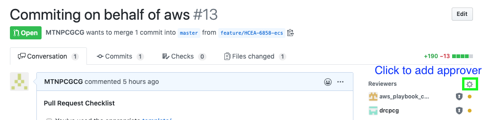

# APPROVAL
Approval workflow for new or existing playbooks for AWS


## Submission
The proposed revision will be submitted by AWS professional services or internal teams that are writing playbooks. The [README](/README.md) captures what submitters are supposed to do, and it's assumed it's completed prior to starting here.

## Approval
The [aws_playbook_core](https://github.com/orgs/open-itg/teams/aws_playbook_core) will be expected to monitor all incoming PR's, and can subscribe for notifications both in GitHub and the [notification slack](https://cg-itg.slack.com/archives/C013ER0C4KV). 

### *** New Service Playbook Only ***
While the `aws_playbook_core` team represents the risk approval, an additional technology SME may be required. 

If this is a new playbook, the first responsibility of `aws_playbook_core` is to identify and register the supplementary approver. Identify the relevant party, and get their GitHub id to add them as an approver. 


#### Updating CodeOwners
To prevent needing to identify the service owner every time there's an update, the `aws_playbook_core` team will update the [CODEOWNERS](/CODEOWNERS) file to include the routing for future PR's. 

1. On the branch that is being reviewed (eg, feature/HCEA-8511), go to the CODEOWNERS file in the GitHub browser, and press the 'edit' button.


2. Add a line for the new service, with the first piece being the folder for the service's documents and the rest being required reviewers.  EG, if we wanted to make @MTNPCGCG a required reviewer on the new 'psuedo' service, it should look like:

```
/pseudo/ @open-itg/aws_playbook_core @MTNPCGCG
```

We always add `@open-itg/aws_playbook_core` to ensure review by the core team. 

3. Click the commit changes button, committing directly to the branch. 


### Reviewing Request
Major objectives for reviewers on playbooks
1. Are there encryption requirements, both at rest and in transit?
1. Are there authentication/authorization requirements?
1. Are there network requirements to prevent public/misc access?
1. And more... but that's the starting point

### Merging request
Whichever party (the aws_playbook_core or the supplementary reviewer) finishes approving last should merge the pull request.

