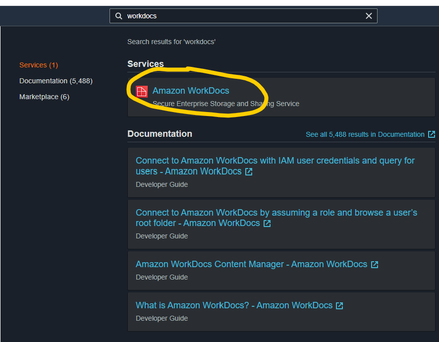

# AWS WorkDocs - Security Playbook <!-- omit in toc -->

## NIST Cybersecurity Framework Alignment <!-- omit in toc -->

**Generated By:**  
[Rob Goss (RMG)](https://cgweb3/profile/RMG), The Capital Group Security Engineering 
Eugene C. Olsen, The Spur Group
 

**Last Update:** *04/22/2021*

## Table of Contents <!-- omit in toc -->
- [Overview](#overview)
- [Preventative Controls](#Preventative-Controls)
  - [1. WorkDocs can exclude public access through IP address controls](#1-WorkDocs-can-exclude-public-access-through-IP-address-controls)
  - [2. WorkDocs can exclude public access through public share settings](#2-WorkDocs-can-exclude-public-access-through-public-share-settings)
  - [3. WorkDocs utilizes Microsoft Active Directory (AD) Policy to enforce least privilege](#3-WorkDocs-utilizes-Microsoft-Active-Directory-(AD)-to-enforce-least-privilege)
  - [4. WorkDocs utilizes IAM Roles to enforce least privilege](#4-WorkDocs-utilizes-IAM-Roles-to-enforce-least-privilege)
  - [5. WorkDocs connections are protected with TLS 1.2](#5-WorkDocs-connections-are-protected-with-TLS-1.2)
  - [6. WorkDocs documents are encrypted using CG managed KMS Keys](#6-WorkDocs-documents-are-encrypted-using-CG-managed-KMS-Keys)
- [Detective Controls](#Detective-Controls)
  - [1. WorkDocs documents are tagged according to CG standards](#1-WorkDocs-documents-are-tagged-according-to-CG-standards)
  - [2. CloudTrail logging enabled and sent to Splunk](#2-CloudTrail-logging-enabled-and-sent-to-Splunk)
- [Respond & Recover](#Respond/Recover)
- [Endnotes](#Endnotes)
- [Capital Group Control Statements](#Capital-Group-Control-Statements)
- [Capital Group Glossory](#Capital-Group-Glossary) 

## Overview
Amazon WorkDocs is a fully managed, secure content creation, storage, and collaboration service. With Amazon WorkDocs, you can easily create, edit, and share content, and because it’s stored centrally on AWS, access it from anywhere on any device.

Amazon WorkDocs lets you integrate with your existing systems, and offers a rich API so that you can develop your own content-rich applications.

**Note:** Prior to January 2015, the Amazon WorkDocs service was called Amazon Zocalo.
  

  

**The core features of WorkDocs allow document preparers to:**
 - Securely share with internal teams.
 - Route documents using approval workflow.
 - Bring content into applications and processes.
   

## Preventative Controls

### 1. WorkDocs can exclude public access through IP address controls

**Capital Group:**  

|Control Statement|Description|
|------|----------------------|
|6|Any AWS service used by CG should not be directly available to the Internet and the default route is always the CG gateway.|
|7|Use of AWS IAM accounts are restricted to CG networks.|
 

**Why?** 
CG requires no public access by default.
 

**How?** 
Creation of WorkDocs resources that adhere to CG's current Security Standards and Controls will begin with restricting access to only IP addresses within the CG internal network.

**Step 1:** Sign into your AWS account and navigate to the *"WorkDocs"* service via the AWS search bar as below. 
   

**Step 2:** Click on the link to the WorkDocs site you want to protect. 
   
   
**Step 3:** Click on the account icon. 
   

**Step 4:** Open the Admin Control Panel.
   

**Step 5:** Click the Change button for the IP Allow List.
   

**Step 6:** Enter enter the Classless Inter-Domain Routing (CIDR) block for the IP address ranges to allowlist, and choose **Add.**  Then choose **Save Changes.** 
   

Users who connect to your site from the IP addresses on the IP Allow List are allowed access. Users who attempt to connect to your site from unauthorized IP addresses receive an unauthorized response.
 

### 2. WorkDocs can exclude public access through public share settings

`This Section will be updated soon.`    No Public Sharing

### 3. WorkDocs utilizes Microsoft Active Directory (AD) to enforce least privilege

`This Section will be updated soon.`

### 4. WorkDocs utilizes IAM Roles to enforce least privilege

`This Section will be updated soon.`

### 5. WorkDocs connections are protected with TLS 1.2

`This Section will be updated soon.`

### 6. WorkDocs documents are encrypted using CG managed KMS Keys

`This Section will be updated soon.`
  

## Detective Controls

### 1. WorkDocs documents are tagged according to CG standards

`This Section will be updated soon.`

### 2. CloudTrail logging enabled and sent to Splunk

`This Section will be updated soon.`
  

## Respond/Recover

`This Section will be updated soon.`
  

## Endnotes
**Resources** 
1. https://aws.amazon.com/workdocs
2. https://docs.aws.amazon.com/workdocs/latest/userguide/workdocs-ug.pdf
3. https://docs.aws.amazon.com/workdocs/latest/adminguide/compliance.html
4. https://docs.aws.amazon.com/workdocs/latest/adminguide/manage-sites.html#ipfiltering
5. https://docs.aws.amazon.com/workdocs/latest/adminguide/manage-sites.html#external_share_settings
6. https://confluence.capgroup.com/display/NETT/Proxy_IP_Addressing

 

## Capital Group Control Statements
1. All Data-at-rest must be encrypted and use a CG BYOK encryption key.
2. All Data-in-transit must be encrypted using certificates using CG Certificate Authority.
3. Keys storied in a Key Management System (KMS) should be created by Capital Group's hardware security module (HSM) and are a minimum of AES-256.
4. AWS services should have logging enabled and those logs delivered to CloudTrail or Cloud Watch.
5. Local AWS IAM accounts are restricted to services and no user accounts are to be provisioned including IaaS resources.
6. Any AWS service used by CG should not be directly available to the Internet and the default route is always the CG gateway.
7. Use of AWS IAM accounts are restricted to CG networks.
8. Local IAM secrets are rotated every 90 days, including accounts IaaS resources.
9. Encryption keys are rotated annually.
10. Root accounts must have 2FA/MFA enabled.
 

## Capital Group Glossary 
**Data** - Digital pieces of information stored or transmitted for use with an information system from which understandable information is derived. Items that could be considered to be data are: Source code, meta-data, build artifacts, information input and output.  
 
**Information System** - An organized assembly of resources and procedures for the collection, processing, maintenance, use, sharing, dissemination, or disposition of information. All systems, platforms, compute instances including and not limited to physical and virtual client endpoints, physical and virtual servers, software containers, databases, Internet of Things (IoT) devices, network devices, applications (internal and external), Serverless computing instances (i.e. AWS Lambda), vendor provided appliances, and third-party platforms, connected to the Capital Group network or used by Capital Group users or customers.

**Log** - a record of the events occurring within information systems and networks. Logs are composed of log entries; each entry contains information related to a specific event that has occurred within a system or network.

**Information** - communication or representation of knowledge such as facts, data, or opinions in any medium or form, including textual, numerical, graphic, cartographic, narrative, or audiovisual. 

**Cloud computing** - A model for enabling ubiquitous, convenient, on-demand network access to a shared pool of configurable computing resources (e.g., networks, servers, storage, applications, and services) that can be rapidly provisioned and released with minimal management effort or service provider interaction.

**Vulnerability**  - Weakness in an information system, system security procedures, internal controls, or implementation that could be exploited or triggered by a threat source. Note: The term weakness is synonymous for deficiency. Weakness may result in security and/or privacy risks.